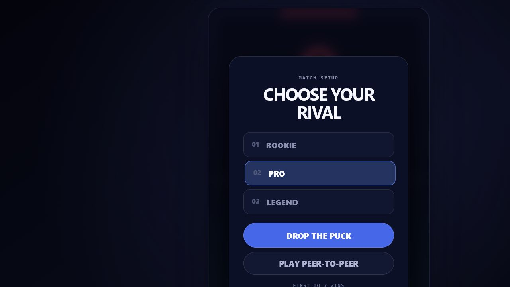
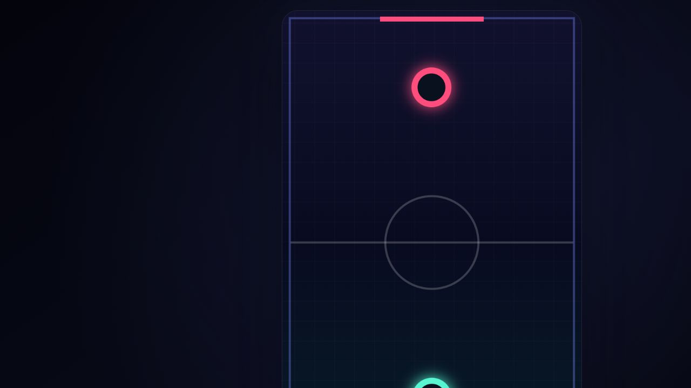

# Air Hockey

A fast neon browser air hockey game with computer opponents, a shared-field 3 VS 3 mode, and server-relayed online multiplayer over WebSocket.

Test the game here: [https://wwbt-blog.ru/sandbox/air-hockey/](https://wwbt-blog.ru/sandbox/air-hockey/).

## Multiplayer

Challenge a friend without registration or accounts. One player creates a room and shares its six-character code; the second player enters the code, and both browsers join the same persistent WebSocket room on the Node.js server.

The host runs the authoritative simulation. The guest sends striker input and receives synchronized puck, score, player, and sound events. All multiplayer traffic is relayed through Node.js, so the game does not depend on WebRTC, STUN, TURN, direct browser-to-browser connectivity, or NAT traversal.

## Preview



### Gameplay



## Running the Game

```powershell
npm install
npm run dev
```

Open `http://127.0.0.1:5173`. Another device on the same LAN can use the network address printed by the server.

To select another port:

```powershell
$env:PORT=5174
npm run dev
```

## Mechanics

- Mouse, pen, and touch striker control;
- Classic 1 VS 1 against an AI opponent;
- Shared-field 3 VS 3 with goalkeeper, midfielder, and forward roles;
- Blue player striker and mint AI teammates in team mode;
- AI positioning, defending, attacking, and passes toward the player;
- Rookie, Pro, and Legend difficulty levels;
- First to seven goals wins;
- Velocity-based puck collisions and gradual friction;
- Synthesized rail, striker, and goal sounds;
- Contact-release logic for puck traps near rails and corners;
- Pause, restart, and return-to-menu controls;
- Mobile canvas optimization and rendering at up to 60 FPS.

## Online Match

Online multiplayer uses the classic 1 VS 1 ruleset. It is disabled while 3 VS 3 is selected.

1. Player one selects **Create match** and copies the six-character code.
2. Player two selects **Join match** and enters the code.
3. Both clients keep a WebSocket connection to Node.js.
4. The host simulates the game and the server relays input and snapshots.

Rooms live in memory and are removed when either player disconnects.

## Building

```powershell
npm run build
```

The TypeScript source is split into focused modules:

- `audio.ts` — synthesized sound effects;
- `config.ts` — board constants and device settings;
- `game.ts` — simulation, physics, AI, rendering, and game state;
- `network.ts` — WebSocket connection, room protocol, input, and snapshots;
- `types.ts` — shared TypeScript types;
- `ui.ts` — DOM element references;
- `main.ts` — application wiring and event handlers.

esbuild bundles the browser modules into one `dist/air-hockey.js`. The Node.js WebSocket server is built separately as `dist/server.js`; its runtime dependency `ws` remains in `node_modules`.

## Embedding

For solo play, build the project and copy `dist/air-hockey.js`, `index.html`, `styles.css`, and `favicon.svg`. The script expects the canvas and controls defined in `index.html`. Online Match additionally requires the WebSocket relay in `server.ts` or a compatible implementation of its room protocol.
